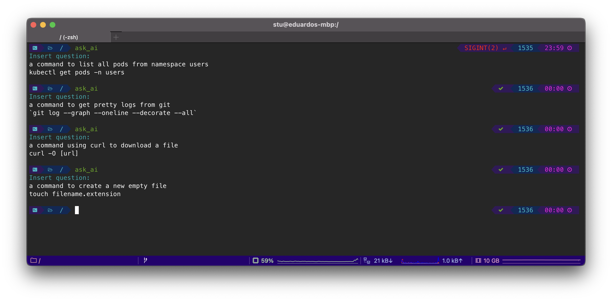

# Ask AI Bash

Open AI Chat-GPT-3 bash script.

## Installation

1. Create an OpenAI api key
2. Include `export OPENAI_APIKEY=YOURKEY` into your `.zshrc` or `.bash_profile`
3. Download [ask_ai_bash.sh](./ask_ai_bash.sh) or use the following command to download and insert automatically into your `.zshrc` or `.bash_profile` file.

```sh
curl -o $HOME/ask_ai_bash.sh https://raw.githubusercontent.com/eduardostuart/ask_ai_bash/main/ask_ai_bash.sh && echo "source $HOME/ask_ai_bash.sh" >> ~/.zshrc && source ~/.zshrc
```

## Usage

```sh
ask_ai
# eg.: input/output
# Insert question:
# give me a command to list all pods from namespace xyz
# kubectl get pods -n xyz
```

## Author

[Eduardo Stuart](https://s.tuart.dev)
